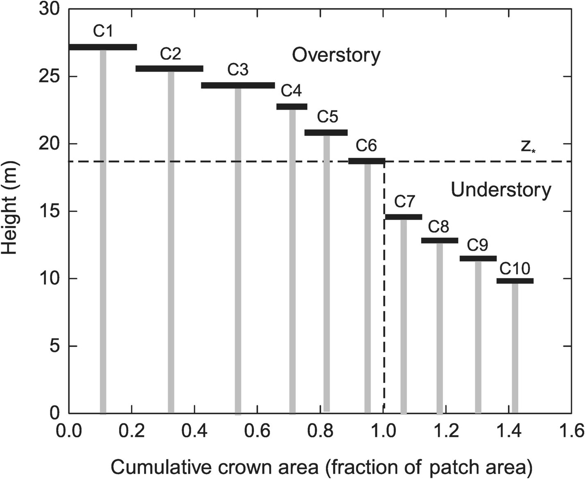
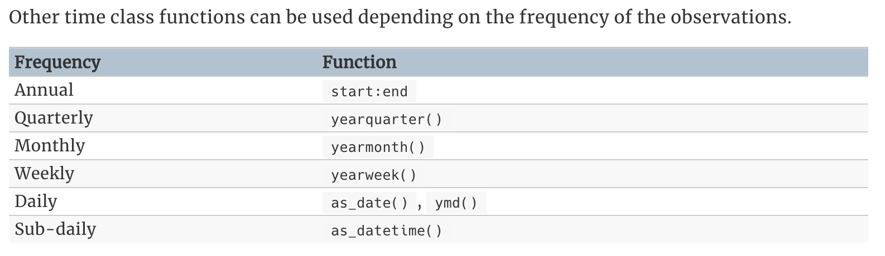
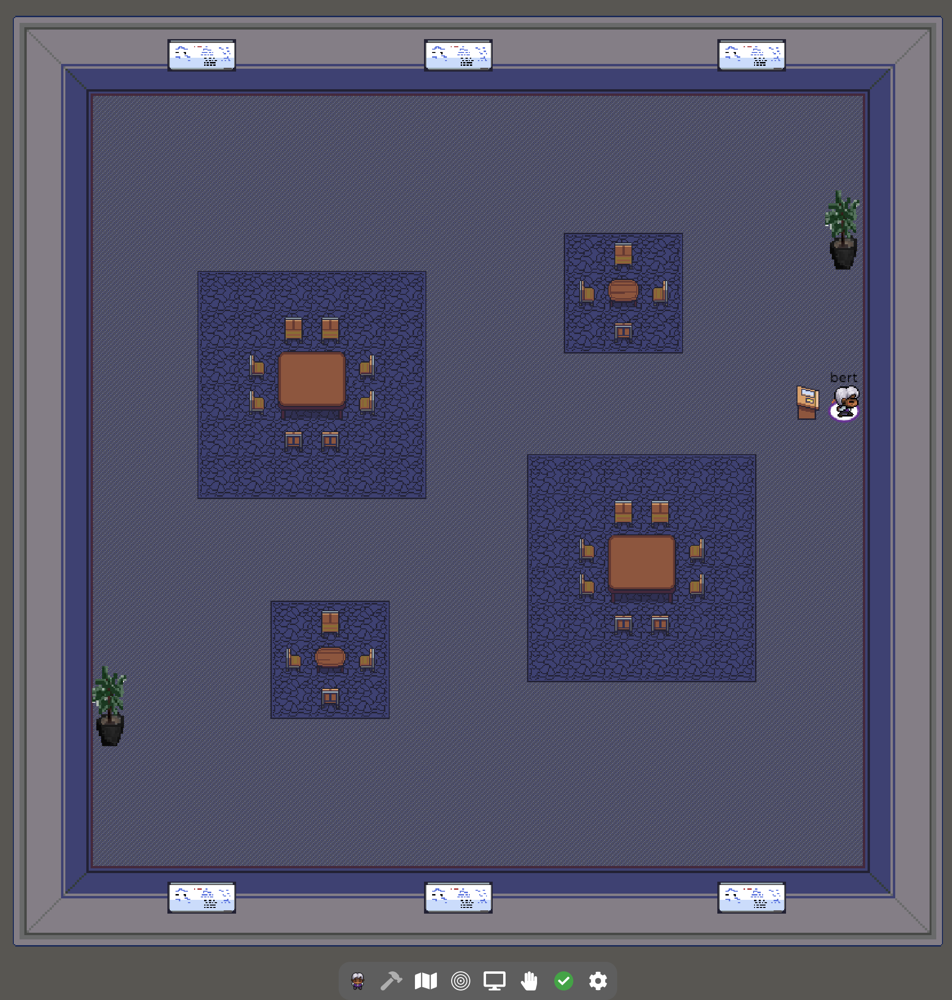
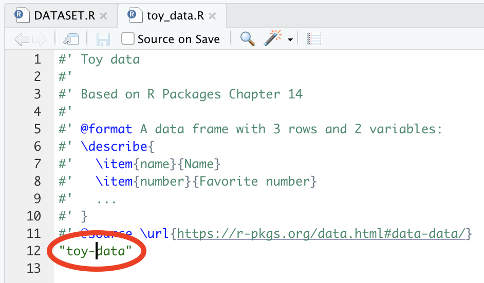

<style>
h1{font-weight: 400;}
</style>

```{r setup, include=FALSE}
knitr::opts_chunk$set(
  echo=TRUE, 
  message=FALSE, 
  warning=FALSE, 
  eval=TRUE, 
  fig.width=16/2, 
  fig.height=9/2
)
library(tidyverse)
library(lubridate)
library(stringr)
library(forcats)
library(moderndive)

# Formating packages:
library(knitr)
library(kableExtra)
library(scales)

# Etc
library(here)
library(patchwork)
library(fpp3)

# Set seed value of random number generator to get "replicable" random numbers.
set.seed(76)

# For "copy code" button for code chunks
klippy::klippy()

# Student list for group making
students <- c("Candy", "Emma S.", "Emma K.", "Haley", "Lauren", "Olivia", "Serena", "Sophie", "Starry", "Nidhi")
```


***


# Schedule 

<iframe src="https://docs.google.com/spreadsheets/d/e/2PACX-1vQw8rrRUpbMRdy01pwUDw4C65XK1ekgQZWUeWN66L5KrAwtXuWMuo1EEk-2qULxsYPforSIAIsEI1dY/pubhtml?gid=1373353942&amp;single=true&amp;widget=true&amp;headers=false" width="100%" height="625"></iframe>

<!--
1. NCFDD topics:
    1. Week 5: Assess and Adjust. Show "What's holding you back?" PDF
    1. Week 7: Mentoring Networks. "What do I need?"
1. Round two of testing new [gather.town](https://gather.town/app/EwDPdjUZOVUU7YrK/rudeboybert){target="_blank"} breakout room format. Password is the same as for lectures.

{target="_blank"}
--> 


***


# Lec 24: Tue 11/24 {#Lec24}

## Before class preparation

1. Test out voice recording:
    1. Open your phone's voice recorder app:
        + Android: Voice Recorder
        + iOS: Voice Memos
    1. Record a test 10 second clip of you speaking
    1. Send it to me via email.
1. Create a new Google Doc from your Smith Google Drive, title it "🤮1️⃣📝 - YOUR NAME", share it with me so that I can edit it, and then send me a link to it in a private Slack DM (not the group channel). 

## Class meeting time

1. Announcement: I finished another pass of MP grading yesterday. The last day to submit/resubmit is Tue 12/8. 
1. Presentation by Group 2 - Parameter Estimation
1. In-class activity


***


# Lec 23: Thu 11/19 {#Lec23}

1. Presentation by Group 3 - Wildfire biomass estimation
1. Presentation by Group 4 - Competitor/neighbor modeling
1. [Link](https://smith.zoom.us/rec/share/yTl4TVKELIYwDB628FUfQs_N3r1pX76RJ6XzTUqraIOBqnIf4f4UTd51ouHc4GxM.oZfJ_9C5D2G7_G9I?startTime=1605797115000){target="_blank"} to video recording.


***


# Lec 22: Tue 11/17 {#Lec22}

1. Presentation by Group 1 - Time Series Forecasting
1. [Link](https://smith.zoom.us/rec/share/qOCKBl02NUfvCkR65BMUIL7-56mN7ulEbTRAgz2o_p9uk7EDTz3_ASl7h9MlLa1l.ssR8UE_BRCG20GH-?startTime=1605624280000){target="_blank"} to video recording.


***


# Lec 21: Thu 11/12 {#Lec21}

1. Presentation by Group 2 - Parameter Estimation
1. Virtuo-spatial classroom demo part 2. Click [here](https://gather.town/app/LBDYE6rQpFibibq6/classroom-24){target="_blank"} to access classroom. See Slack for password.
1. "Close the loop" on discussions about [mentor map](https://ncfdd-production-file-uploads.s3.amazonaws.com/media/219/Mentor%20Maps%202019%20Filliable.pdf){target="_blank"}. 
1. [Link](https://smith.zoom.us/rec/share/oR2c3ZInpKWJLaVec9UR4tM9G9B2l7Wr2xN0are0FuI1_MAgM9geyzG7MAb-Slrv.uByJkIrYjK5wvPbW?startTime=1605192296000){target="_blank"} to video recording.


***


# Lec 20: Tue 11/10 {#Lec20}

No lecture. I encourage you to participate in [Cromwell Day 2020](https://www.smith.edu/about-smith/college-events/cromwell-day/events-2020){target="_blank"} programming. 


***


# Lec 19: Thu 11/5 {#Lec19}

1. Mid-semester assessment survey
1. Presentation by Group 3 - Wildfire biomass estimation
1. ~~Virtuo-spatial classroom demo part 2. Click [here](https://gather.town/app/LBDYE6rQpFibibq6/classroom-24){target="_blank"} to access classroom.~~
1. "What do I need?" Download this [mentor map](https://ncfdd-production-file-uploads.s3.amazonaws.com/media/219/Mentor%20Maps%202019%20Filliable.pdf){target="_blank"} and start filling it in. 
1. [Link](https://smith.zoom.us/rec/share/J5DeqNnvtoJInb0vmyeriDP_FydwtCk8W8MGC_wlVqDSyCMrfcidGCSG-qwRkbH_.DwcSmDDlms6p-xRk?startTime=1604587487000){target="_blank"} to video recording.


***


# Lec 18: Tue 11/3 {#Lec18}

1. Announcements:
    1. I will make another MP grading push later today/early on Wednesday
    1. Plan for Thursday's lecture
1. Breakout rooms: Before lecture, think for 5 minutes about any of the obstacles in the ["What's holding you back?"](https://ncfdd-production-file-uploads.s3.amazonaws.com/media/dd31a906-b475-4fcc-82d8-bd0ace7ee077-WhatsHoldingYouBack.pdf){target="_blank"} slide we discussed in Lec 17.
1. Presentation by Group 1 - Time Series Forecasting


***


# Lec 17: Thu 10/29 {#Lec17}

1. *Tentative* plan for next week:
    1. Tue 11/3 Group 1 - Time Series Forecasting
    1. Thu 11/5 Group 3 - Wildfire Biomass Estimation
1. Presentation by Group 2 - Parameter Estimation
1. Breakout rooms: Underneath it all podcast
1. ["What's holding you back?"](https://ncfdd-production-file-uploads.s3.amazonaws.com/media/dd31a906-b475-4fcc-82d8-bd0ace7ee077-WhatsHoldingYouBack.pdf){target="_blank"}
1. Fill out [MSA survey](https://smithcollege.qualtrics.com/jfe/form/SV_ey8fSCWwFZs7oe9){target="_blank"}.
1. [Link](https://smith.zoom.us/rec/share/bo4oTN3l-tajolw7GH5S-wIDs_aNTpS0qmjpgYpfeIDpPrD62HRO0InSUGRIOqTG.YTGhgLqys5W1A3kJ){target="_blank"} to video recording.


***


# Lec 16: Tue 10/27 {#Lec16}

No lecture. Focus on getting that quick win!


***


# Lec 15: Thu 10/22 {#Lec15}

## Videos

None


## Class meeting time

1. Lecture topics: Approximating the overstory using the perfect plasticity approximation.
    ```{r, echo=FALSE, out.width="50%", fig.align='center'}
    
    ```
1. Project discussion and breakout room
1. [Link](https://smith.zoom.us/rec/share/xLO_ZjhkwA4MS4gY49an2DxzXUUG6niq5CFOkRcz8SbeBZ-Pgs_rFGel6Ory_0OZ.Hyl7Lh0l-aQRawbc){target="_blank"} to video recording and [PDF](static/chalk_talks/Lec15.pdf){target="_blank"} of class notes. 


***


# Lec 14: Tue 10/20 {#Lec14}

## Videos

None


## Class meeting time

1. Announcements:
    1. New round of feedback for all MP2, MP3, and MP4 has been delivered.
    1. Don't forget to submit your project preferences [Google Form](#MP6) by Wednesday 10/21 at 7pm Eastern. Related: Prof. Jesse Bellemare said he will provide [data](https://esajournals.onlinelibrary.wiley.com/doi/full/10.1002/ecs2.2391){target="_blank"} for incorporation into `macleish` package.
1. Lecture topics
    1. From Lec11: How to manually set interval length in a `tsibble()`
    1. From Lec11: How to take Australian Beer training data example and make it representative.
    1. ~~Approximating the overstory using the perfect plasticity approximation:~~
1. Next lecture: Round two of testing new [gather.town](https://gather.town/app/EwDPdjUZOVUU7YrK/rudeboybert){target="_blank"} breakout room format. Password is the same as for lectures.
1. [Link](https://smith.zoom.us/rec/share/6Mjs-diUjs4UGsJINjN2FmKvHwWFeYtPRotrUr3zLiw3lfA6kUpvEYQ-2v4gL2-U._UoEza4QfdpBfmmD){target="_blank"} to video recording and [PDF](static/chalk_talks/Lec14.pdf){target="_blank"} of class notes. 


### Lecture topic 1

How to manually set interval length in a `tsibble()`. Using "time class functions" from [FPP 2.1](https://otexts.com/fpp3/tsibbles.html){target="_blank"} include:

```{r, echo=FALSE, out.width="80%", fig.align='center'}

```  

```{r}
# Lec14 code
library(tsibble)
library(lubridate)

# From https://otexts.com/fpp3/tsibbles.html. Manually setting yearly data
yearly <- tsibble(
  Year = 2015:2019, 
  Observation = c(123, 39, 78, 52, 110), 
  # Note this sets the increment value to [1Y]. It seems to autodetect that this
  # is yearly data:
  index = Year
)
autoplot(yearly)

# Setting daily data
daily <- tsibble(
  Day = seq(from = ymd("2020-10-01"), to = ymd("2020-10-06"), by = "1 day"),
  Value = c(76, 4, 79, 9, 11, 66),
  # Note this sets the increment value to [1D]. This is easy to detect since
  # Day is a "date" object
  index = Day
)
autoplot(daily)
```


### Lecture topic 2

Is your training data *representative* of your test data? From [Kaggle Airbnb prediction competition](https://www.kaggle.com/c/airbnb-recruiting-new-user-bookings){target="_blank"}. You are interested in predicting/forecasting whether a new Airbnb user makes a booking within the first month of signing up. See this [plot](static/airbnb.pdf){target="_blank"}.


### Lecture topic 3

Approximating the overstory using the *perfect plasticity approximation*.

```{r, echo=FALSE, out.width="50%", fig.align='center'}

``` 


***


# Lec 13: Thu 10/15 {#Lec13}

## Videos

### 1. Paradise Pond data collection activity

A data collection activity near [Paradise Pond](https://www.google.com/maps/place/42%C2%B019'01.5%22N+72%C2%B038'39.3%22W/@42.3170872,-72.6464387,17z/data=!3m1!4b1!4m5!3m4!1s0x0:0x0!8m2!3d42.3170833!4d-72.64425){target="_blank"} on Smith College campus. 

</br>
<center>
<iframe width="560" height="315" src="https://www.youtube.com/embed/vWAkx-G0juw" frameborder="0" allow="accelerometer; autoplay; clipboard-write; encrypted-media; gyroscope; picture-in-picture" allowfullscreen></iframe>
</center>
</br>


## Class meeting time

1. Announcements:
    1. I'll make a big push on MP feedback today. Note if you have a grade of 50% in Moodle for a MP, it just means it's still in "incomplete" and you have more work to do. 
    1. Questions from Lec11 punted to Lec14:
        1. How to manually set interval length in a `tsibble()`
        1. How to take Australian Beer training data example and make it representative.
1. Breakout rooms: Thanks for your feedback. Changes: they'll be slightly shorter and rooms will always have 3+ people.
    1. Podcast on migration
    1. Paradise Pond activity
1. Tested new [gather.town](https://gather.town/app/EwDPdjUZOVUU7YrK/rudeboybert){target="_blank"} breakout room format. Password is the same as for lectures. 
    ```{r, echo=FALSE, out.width="50%", fig.align='center'}
    
    ```
1. [Link](https://smith.zoom.us/rec/play/e2LQ63Ptyyzcyxr8Bp_em5bXj-H_soO8l6SO_cXV0RyIhDqsFSjlggOklsiUKFWY202SnMyCCDMzAmIK.Qywdirzg2pXIyFV1?startTime=1602769531000){target="_blank"} to video recording. Also relevant links from class:
    1. [Microsoft AI's SilviaTerra](https://www.microsoft.com/en-us/ai/ai-for-earth-silviaterra){target="_blank"} research on using machine learning methods on aerial imagery of forests, including associating portions of overstory/canopy images to individual trees.
    1. Related to podcast on migration: *"Fighting the fly is really a **fight for the homeland**, in a sense. Potential battle plans include a nightmare-inducing scenario..."* as worded by [NBC10 Philadelphia's article](https://www.nbcphiladelphia.com/news/local/spotted-lanternfly-risks-dangers-pennsylvania-philadelphia/1978747/){target="_blank"} on the Spotted Lanternfly. 😬😬😬


## For next week

### 1. Readings

1. **Podcast**: Underneath It All [EPISODE 2 - ASSIGNING A NEGATIVE](https://www.underneathitallpodcast.com/episodes/episode-2-assigninganegative){target="_blank"}. Akuna and Grizel discuss the effects of racism on Akuna’s mental health, living with PTSD, and how people with mental health challenges are often assigned a negative stereotype. They also discuss how racial injustice stems into everyday living, including his safest and happiest place: Nature. 


### 2. MP6 {#MP6}

1. Complete [Project Google Form](https://docs.google.com/forms/d/e/1FAIpQLSfm_OoM_4XR3MWRfe3uFMShQqsTcvww0f-xZOlFyN7LAIwe8Q/viewform){target="_blank"} by Wednesday 10/21 at 7pm Eastern. Project details can be found [here](https://docs.google.com/document/d/1PeQXPsnxe6ZJjiBGBXD3dRfTKNETKMQpzIJUSWgTYr0/edit){target="_blank"}.
1. Eastern Hemlocks near Paradise Pond:
    1. How much [*biomass*](https://en.wikipedia.org/wiki/Biomass_(ecology)){target="_blank"} is there? Use the development version of the [`allodb`](https://github.com/forestgeo/allodb){target="_blank"}.
    1. Model the relationship between dbh and height
    1. Dropped from MP6: ~~Model the overstory of Paradise Pond using the *perfect plasticity approximation* method~~~

Download <a href="static/MP6.Rmd" download>`MP6.Rmd`</a>, complete your work, and submit on Moodle.    


***


# Lec 12: Thu 10/8 {#Lec12}

Cancelled.


***


# Lec 11: Tue 10/6 {#Lec11}

## Videos

### 1. Time series decompositions & simple forecasting methods

Summaries of 

1. [FPP3 Chap 3.2](https://otexts.com/fpp3/components.html){target="_blank"} on time series decompositions
1. [FPP3 Chap 5.2](https://otexts.com/fpp3/simple-methods.html){target="_blank"} on simple forecasting methods

</br>
<center>
<div style="position: relative; padding-bottom: 56.25%; height: 0;"><iframe src="https://www.loom.com/embed/041b824b0cae41d29eb6e973b8f5a6a5" frameborder="0" webkitallowfullscreen mozallowfullscreen allowfullscreen style="position: absolute; top: 0; left: 0; width: 100%; height: 100%;"></iframe></div>
</center>
</br>

Add this code to your running lecture notes code:

```{r, eval = FALSE, echo=TRUE, class.source="klippy"}
# Lec11 code -------------------------------------------------------------------
library(tidyverse)
library(tsibble)
library(lubridate)
library(fpp3)


# Time series decompositions ---------------------------------------------------
# From FPP3 Chap 3.2: https://otexts.com/fpp3/components.html
us_retail_employment <- us_employment %>%
  filter(year(Month) >= 1990, Title == "Retail Trade") %>%
  select(-Series_ID)

# Note: period is [1M] = 1 month:
us_retail_employment

# Plot
us_retail_employment_plot <- us_retail_employment %>%
  autoplot(Employed, color = "gray") +
  labs(x = "Year", y = "Persons (thousands)", title = "Total employment in US retail")
us_retail_employment_plot

# Fit STL decomposition
stl_dcmp <- us_retail_employment %>%
  model(STL(Employed))

# Inspect contents:
components(stl_dcmp)

# What does this mean? The curve in red = signal which you separate from noise.
us_retail_employment_plot + 
  autolayer(components(stl_dcmp), trend, color = "red")

components(stl_dcmp) %>% 
  autoplot() + 
  xlab("Year")


# Simple forecasting methods ---------------------------------------------------
# From FPP3 Chap 5.2: https://otexts.com/fpp3/simple-methods.html

# Note: period is [1Q] = 1 quarter:
aus_production

# Plot
aus_production %>%
  autoplot(Beer) +
  labs(x = "Year", y = "Beer production (megalitres)", 
       title = "Total beer production in Australia")

# Set "training" data: Only from 1992-2006
train <- aus_production %>% 
  filter_index("1992 Q1" ~ "2006 Q4")

train %>%
  autoplot(Beer) +
  labs(x = "Year", y = "Beer production (megalitres)", 
       title = "Total beer production in Australia")

# Fit/train the models
beer_fit <- train %>%
  model(
    Mean = MEAN(Beer),
    `Naïve` = NAIVE(Beer),
    `Seasonal naïve` = SNAIVE(Beer)
  )

# Generate predictions/forecasts for 14 quarters
beer_fc <- beer_fit %>% 
  forecast(h=14)

# Plot forecasts
beer_fc %>%
  autoplot(train, level = NULL) +
  labs(x = "Year", y = "Beer production (megalitres)", 
       title = "Total beer production in Australia", col = "Forecast")

# Plot forecasts and actual observed values post 2007 Q1
beer_fc %>%
  autoplot(train, level = NULL) +
  labs(x = "Year", y = "Beer production (megalitres)", 
       title = "Total beer production in Australia", col = "Forecast") +
  autolayer(filter_index(aus_production, "2007 Q1" ~ .), color = "black")

# Plot forecasts with prediction error bands
beer_fc %>%
  autoplot(train) +
  labs(x = "Year", y = "Beer production (megalitres)", 
       title = "Total beer production in Australia", col = "Forecast")
```


## Class meeting time

1. Asking for help: [Minimal reproducible examples](https://stackoverflow.com/help/minimal-reproducible-example){target="_blank"}. In R circles, these are called [reprex's](https://www.tidyverse.org/help/){target="_blank"}: (repr)oducible (ex)amples
    1. Open RStudio
    1. If you haven't already, install the `reprex` package
    1. Open the `foofactors` [GitHub issues](https://github.com/390-2020-09-Fall/foofactors/issues){target="_blank"} page
    1. Copy and paste this code into your .R or .Rmd file where you've been saving course code
    ```{r, eval = FALSE}
    library(dplyr)
    
    ggplot(mtcars, aes(x = as.factor(cyl), y = hp)) +
      geom_boxplot()
    ```
1. Breakout rooms
    1. Time series
    1. MP4 code reviews
    1. MP5
1. Please fill out this [(Anonymous) Google Form](https://docs.google.com/forms/d/e/1FAIpQLSexjl7dkC5CS8kAUZ-8uJV3gOmdDm3dAChT11jXhukwK_GipQ/viewform){target="_blank"}
1. [Link](https://smith.zoom.us/rec/share/5BTfjBFR2XZfY2BqSclR6fsmqSwjZOvOzBoOI-t-qxO5T_xwbFIN6elGJ8cayttC.R_PekP9LYX8lDqJk?startTime=1601991900000){target="_blank"} to video recording

 

***


# Lec 10: Thu 10/1 {#Lec10}

## Videos

### 1. The Anatomy of a GitHub Pull Request

Learning more about GitHub Pull Requests as well as GitHub Issues using this [example](https://github.com/rudeboybert/forestecology/pull/37){target="_blank"}.

</br>
<center>
<div style="position: relative; padding-bottom: 56.25%; height: 0;"><iframe src="https://www.loom.com/embed/f4090c33caa5424eb3eb3d136dfa2987" frameborder="0" webkitallowfullscreen mozallowfullscreen allowfullscreen style="position: absolute; top: 0; left: 0; width: 100%; height: 100%;"></iframe></div>
</center>
</br>


### 2. ~~Time series decompositions & statistics~~ ES&P Presentation	

Watch my [presentation](https://smith.zoom.us/rec/share/qCAT70076QjI1FsPeDW0Rja9ev-iunwsrEyqVJVW-27gDrKTggw7QYKUYfNgyLeB.dx0K3Ygv81KXuHfA){target="_blank"} to the Environmental Science & Policy program, from 14:22 to 24:53. Password is on Slack.

### 3. Inspecting a GitHub Pull Request

**Added after lecture on Thu 10/1 4pm** 

</br>
<center>
<div style="position: relative; padding-bottom: 56.25%; height: 0;"><iframe src="https://www.loom.com/embed/14c270aac2eb4274a92e1888574a889c" frameborder="0" webkitallowfullscreen mozallowfullscreen allowfullscreen style="position: absolute; top: 0; left: 0; width: 100%; height: 100%;"></iframe></div>
</center>
</br>


## Class meeting time

1. Mini-projects
    1. Once PR's for any MP are approved, I'll enter your grade in moodle
    1. I gave feedback for MP3 on Shiny apps this week. Be sure to make requested changes and commit/push.
1. Breakout rooms: 
    1. GitHub pull requests and version control
    1. Growth as a proxy for carbon
1. Discuss MP5
1. [Link](https://smith.zoom.us/rec/share/2OtxlrnfdUJLt4TQJ3pPFxxtX-JophG3aOWUQSTEku29xo1pp4fUpf8E6phZfcGI.dXutWPNmC2mRp3wZ){target="_blank"} to video recording


## For next week

### 1. Readings

1. **FPP**: I moved today's FPP Ch 3-4 discussion to Tuesday. We'll have a single FPP Ch 3-5 discussion then.
1. **Podcast**: [(Link)](https://www.npr.org/2020/06/02/867691497/migration-isnt-crisis-it-s-the-solution-science-writer-says){target="_blank"} The roots of Linnean classification of species and how this influences our notion of "belonging" and "place", and thus our notion of "migration."


### 2. MP5 {#MP5}

Model selection as guided by $R^2_{adj}$ and $AIC$. Everything you need to this MP was covered in Lec09. Two scenarios:

1. Teaching evals data
    1. Interaction model vs
    1. Parallel slopes model
1. Maple trees in the [Michigan Big Woods](https://forestgeo.si.edu/sites/north-america/michigan-big-woods){target="_blank"} ForestGEO site
    1. Distinguish between competitor species
    1. Do not distinguish between competitor species and treat all trees the same

Download <a href="static/MP5.Rmd" download>`MP5.Rmd`</a>, complete your work, and submit on Moodle.


***


# Lec 09: Tue 9/29 {#Lec09}

## Videos

### 1. Model selection

Recall our comparison of two models for interspecies competition from [Lec07](#Lec07). Which model should we select? 

```{r, echo=FALSE, out.width="49%", out.height="20%", fig.cap="Two models for the effect of competitor biomass.", fig.show='hold', fig.align='center'}
knitr::include_graphics(c("static/images/competition_1.png", "static/images/competition_2.png"))
``` 

Model selection attempts to balance (1) goodness-of-fit (how well a model fits points) and (2) model complexity. These two quantities are **inversely related**. Using example data from [ModernDive Chapter 6.3.1](https://moderndive.com/6-multiple-regression.html#model-selection){target="_blank"}, we discuss two numerical methods for selecting between (1) parallel slopes and (2) interaction regression models:

1. R-squared adjusted: $R^2_{adj} = 1 - \frac{n-1}{n - (k+1)}(1-R^2)$
1. Akaike Information Criteria: $AIC = 2k - 2\cdot\text{log-likelihood}$

</br>
<center>
<iframe width="560" height="315" src="https://www.youtube.com/embed/nt6hKLSp3-8" frameborder="0" allow="accelerometer; autoplay; clipboard-write; encrypted-media; gyroscope; picture-in-picture" allowfullscreen></iframe>
</center>
</br>

The code from the video is below. [PDF of chalk talk](static/chalk_talks/Lec09.pdf){target="_blank"}.


```{r, eval = FALSE, echo=TRUE, class.source="klippy"}
# Lec09 code ----------------
library(moderndive)
library(broom)


# Added on Tue 9/29 9:40am: Visualize both models
library(patchwork)
p1 <- ggplot(MA_schools, aes(x = perc_disadvan, y = average_sat_math, color = size)) +
  geom_point(alpha = 0.25) +
  geom_smooth(method = "lm", se = FALSE) +
  labs(
    x = "Percent economically disadvantaged", y = "Math SAT Score",
    color = "School size", title = "Interaction model"
  ) +
  theme(legend.position = "none")
p2 <- ggplot(MA_schools,aes(x = perc_disadvan, y = average_sat_math, color = size)) +
  geom_point(alpha = 0.25) +
  geom_parallel_slopes(se = FALSE) +
  labs(
    x = "Percent economically disadvantaged", y = "Math SAT Score",
    color = "School size", title = "Parallel slopes model"
  ) +
  theme(axis.title.y = element_blank())
p1 + p2


# Fit parallel slopes model: Less complex
model_2_parallel_slopes <- 
  lm(average_sat_math ~ perc_disadvan + size, data = MA_schools)

# Fit interaction model: More complex
model_2_interaction <- 
  lm(average_sat_math ~ perc_disadvan * size, data = MA_schools)


# Updated on Tue 9/29 11am: Compare regression tables. Notice k = 4 vs k = 6
tidy(model_2_parallel_slopes, conf.int = TRUE)
tidy(model_2_interaction, conf.int = TRUE)


# Compare R^2_adj and AIC
glance(model_2_parallel_slopes)
glance(model_2_interaction)
```


## Class meeting time

1. Breakout rooms: Questions about
    1. Model Selection
    1. MP4 on R Packages
1. [Link](https://smith.zoom.us/rec/share/3lmr4qC3Fi8wBKBkrACavKQTuh5AFWkGuinXJpmrXYsAd9vpzxXuFXeq1NIEzbMl.hsPH0TZmkarqgrHy?startTime=1601387106000){target="_blank"} to video recording.


***


# Lec 08: Thu 9/24 {#Lec08}

## Videos

### 1. R Packages

Building a minimally viable R package based on the "R Packages" book [Chapter 2: The whole game](https://r-pkgs.org/whole-game.html){target="_blank"} and a little bit of [Chapter 14: External data](https://r-pkgs.org/data.html){target="_blank"}. [PDF of chalk talk](static/chalk_talks/Lec08.pdf){target="_blank"}.

</br>
<center>
<iframe width="560" height="315" src="https://www.youtube.com/embed/T7jLzGjfEEw" frameborder="0" allow="accelerometer; autoplay; clipboard-write; encrypted-media; gyroscope; picture-in-picture" allowfullscreen></iframe>
</center>
</br>

**Post-video update**: Recall from the end of the video that the reason the `check()` of the package failed was because the `man/toy_data.Rd` help file for the `toy_data` dataset did not get created. The reason is I misspelled the name of the dataset in `R/toy_data.R`:

```{r, echo=FALSE, fig.align="center", out.width="50%"}

```

This is a great lesson in the value of running `check()` often! Fix this by:

1. Fixing the above typo
1. Running `devtools::document()` to create the `man/toy_data.Rd` help file
1. Installing the package locally using `devtools::install()`
1. Checking the package using `devtools::check()`


## Class meeting time

1. Run this code to ensure the following packages are up-to-date: `install.packages(c("devtools", "roxygen2", "testthat", "knitr"))`
1. Announcements:
    1. Stick with lecture start time of 9:45, but we'll keep things moving briskly.
1. Breakout rooms:
    1. Discussion on Vogue article
    1. Other questions
1. Discuss what's next week
1. [Link](https://smith.zoom.us/rec/share/18_mdQR9-Lb_Z814FUVjgdeJRc1VX8BVXbCPnmiBDCh1TDnLU_y-8lPBrDRvc4CU.QOOyscB1PNLL2k8d?startTime=1600955111000){target="_blank"} to video recording.


## For next week

### 1. Readings

1. **Allen 2020**: If you haven't already, dedicate 30 minutes for a "done is better than perfect"
reading. Even if their are gaps in understanding, just encountering the terms and ideas for the first time will prime you for the next time.
1. **FPP3**: In particular the $y_t = S_t + T_t + R_t$ seasonal + trend + remainder breakdown of the $y_t$ US retail employment time series in [Figure 3.10](https://otexts.com/fpp3/classical-decomposition.html#fig:classical-empl){target="_blank"}.

```{r, echo = TRUE}
library(fpp3)
us_retail_employment <- us_employment %>%
  filter(year(Month) >= 1990, Title == "Retail Trade") %>%
  select(-Series_ID)

# Fit decomposition model
dcmp <- us_retail_employment %>%
  model(classical_decomposition(Employed, type = "additive"))

# Plot decomposition model
components(dcmp) %>% 
  autoplot() + 
  labs(x = "Year", title = "Employed = Trend + Seasonal + Remainder")
```


### 2. MP4 {#MP4}

For MP4, you will be adding one documented function, one documented dataset, and your `DESCRIPTION` info to the [`foofactors`](https://github.com/390-2020-09-Fall/foofactors){target="_blank"} package I demoed in the video. You are going to work in the following groups:

```{r}
set.seed(76)
students <- c("Candy", "Emma S.", "Emma K.", "Haley", "Lauren", "Olivia", "Serena", "Sophie", "Starry")
tibble(
  name = sample(students),
  Branch = rep(1:3, times = 3) %>% str_c("group", .),
  member = rep(1:3, each = 3) %>% str_c("Member ", .)
) %>% 
  pivot_wider(names_from = member, values_from = name)
```

You will

1. Each create branches from your group's branch. i.e. a branch of a branch.
1. Each independently work on your function, dataset, and `DESCRIPTION` file, being sure to `install()` and `check()` your package often. 
1. Create a pull request of your branch into the group's branch.
1. Request a *code review*: Member 1 requests a review from Member 2, 2 from 3, and 3 from 1.
1. Go back and forth about requested changes as necessary on the pull request page, just as I did for MP2. 
1. Once approved, Member 2 will merge Member 1's pull request into the group's branch.

Example: Lauren will

1. Create a branch `group1-lauren` from the `group1` branch.
1. Push/commit changes to the package to her `group1-lauren` branch, making sure to `install()` and `check()` her local version of the package often. 
1. Create a pull request of `group1-lauren` into `group1`
1. Tag Haley for a code review.
1. Incorporate changes requested by Haley (if any) 
1. Once approved, Haley will merge Lauren's pull request of the contents of the `group1-lauren` branch into the `group1` branch.


Notes:

1. Later on, we'll eventually merge the changes in the three group branches into `master`.
1. Expect [Oh shit, git!](https://wizardzines.com/zines/oh-shit-git/){target="_blank"} moments, especially *merge conflicts* in the `DESCRIPTION` file.


***


# Lec 07: Tue 9/22 {#Lec07}

## Videos

### 1. Filepaths

*Absolute* filepaths only work on your computer, thus making your work less reproducible. Using filepaths that are *relative* to some assumed *root* folder will work on anybody's computer. The `here` R package facilitates relative filepath use by always assuming the *root* folder is the folder of your RStudio Project. [PDF of chalk talk](static/chalk_talks/Lec07_filepaths.pdf){target="_blank"}.

</br>
<center>
<iframe width="560" height="315" src="https://www.youtube.com/embed/uR26lWqstBY" frameborder="0" allow="accelerometer; autoplay; clipboard-write; encrypted-media; gyroscope; picture-in-picture" allowfullscreen></iframe>
</center>
</br>


### 2. Modeling interspecies competition

Two possible models for the effect of competition on the growth of a tree. Model 1 (in left image): Treating all competitor trees the same. Model 2 (in right image): Distinguishing competitor species. [PDF of chalk talk](static/chalk_talks/Lec07_competition.pdf){target="_blank"}.

```{r, echo=FALSE, out.width="49%", out.height="20%", fig.cap="Two models for the effect of competitor biomass.", fig.show='hold', fig.align='center'}
knitr::include_graphics(c("static/images/competition_1.png", "static/images/competition_2.png"))
``` 

</br>
<center>
<iframe width="560" height="315" src="https://www.youtube.com/embed/FygAzz-JfOs" frameborder="0" allow="accelerometer; autoplay; clipboard-write; encrypted-media; gyroscope; picture-in-picture" allowfullscreen></iframe>
</center>
</br>


## Class meeting time

1. Announcements:
    1. If you haven’t already, please vote in the 3 Poll Everywhere questions posted in `#announcements` on Thursday 9/17.
    1. Starting today we'll be meeting in a dedicated Zoom room that automatically records. See Slack for new Zoom link.
1. Discuss updated Schedule above.
1. MP3: See [updated instructions](#MP3)
1. Breakout rooms
    1. Filepaths: A key step in ensuring reproducibility
    1. Two models for interspecies competition
1. Links to video recordings
    1. [Part 1](https://smith.zoom.us/rec/play/wNnTrm9S3JvHe_uAWkAXBVO_4n3-tnx8b9oSdCF-bwL7IQoC1RmWa7W1qPJNfttN8hgIqZP7wSMcZq4h.c_DXP_DZhlJFfrjg?autoplay=true&startTime=1600782173000){target="_blank"}
    1. [Part 2](https://smith.zoom.us/rec/share/Yt97lNdkNGvTC_Y6x-_hjCMwwAd8Udg9X6srdbGOGpxfxcEnAdSB5xiwoVcQIXbs.jW0nBSc_PYpKyHEO?startTime=1600783430000){target="_blank"}
1. **During office hours** A screencast of creating a minimally viable Shiny app using the MP3 starter code: Converting the histogram from base R to `ggplot2`. Enter usual lecture password below. 

<div style="position: relative; padding-bottom: 56.25%; height: 0;"><iframe src="https://www.loom.com/embed/bab813e2b831436c83a1cf07b094a1c3" frameborder="0" webkitallowfullscreen mozallowfullscreen allowfullscreen style="position: absolute; top: 0; left: 0; width: 100%; height: 100%;"></iframe></div>


***


# Lec 06: Thu 9/17 {#Lec06}

## Videos

### 1. Maximum likelihood estimation

Say you have data that consists of the following pairs of observations: diameter at breast height (dbh) as measured by your dendroband and day of year (doy) of the measurement. How we find the "best fitting" S-shaped curve through these points? In other words, how do we find the "optimal" values of the 5 parameters from the generalized logistic function? Also, what do we even by "best fitting"? [PDF of chalk talk](static/chalk_talks/Lec06.pdf){target="_blank"}.

</br>
<center>
<iframe width="560" height="315" src="https://www.youtube.com/embed/38H_QN3Z4SA" frameborder="0" allow="accelerometer; autoplay; clipboard-write; encrypted-media; gyroscope; picture-in-picture" allowfullscreen></iframe>
</center>
</br>


## Class meeting time

1. Set up today's Shiny app:
    1. Ensure you have the `shiny` package installed.
    1. Download and unzip this <a href="static/data/dendroband_shiny.zip" download>.zip file</a> of a Shiny application RStudio Project. Since this is an RStudio Project, you should not save it inside another RStudio Project
1. Set up Lec06 notes: Wherever it is you're saving lecture files/code
    1. Save the PDF of [A general model of intra-annual tree growth using
dendrometer bands by McMahon and Parker (2015)](https://www.ncbi.nlm.nih.gov/pmc/articles/PMC4314258/){target="_blank"} (open access).
    1. Copy the Lec06 code below as you did for the code in Lec03
1. Announcements:
    1. Please vote on three polls I posted in #announcements on Slack.
    1. Starting next week I'll have a dedicated zoom room for this class that auto-records. I will share link to zoom room on Slack before next lecture.
1. Breakout rooms:
    1. Get the values of the 5 parameters!
    1. Any questions?
1. [Link](https://smith.zoom.us/rec/share/gavffQ0QHbw7Z82trsHofxkysFZWRr3fCIEqWQlJD8I_dVJ3GnhgYUC7t2W8GbEb.o0fkIrER2h0VCgOg?startTime=1600350544000){target="_blank"} to video recording.

```{r, eval = FALSE, class.source="klippy"}
# Lec06 code ----------------
library(tidyverse)

dendroband_data <- read_csv("https://rudeboybert.github.io/SDS390/static/data/observed_dbh_vs_doy.csv")

# Plot data
base_plot <- ggplot() +
  geom_point(data = dendroband_data, mapping = aes(x = doy, y = dbh)) +
  labs(x = "day of year", y = "dbh")
base_plot


# Define the generalized logistic function. Note the params input has to be a
# vector of length 5 in the correct order:
lg5 <- function(params, doy) {
  # Get 5 parameter values
  L <- params[1]
  K <- params[2]
  doy.ip <- params[3]
  r <- params[4]
  theta <- params[5]
  
  # For specified 5 parameters and x = doy, compute y = dbh
  dbh <- L + ((K - L) / (1 + 1/theta * exp(-(r * (doy - doy.ip) / theta)) ^ theta))
  return(dbh)
}


# Let's set an initial guess and plot what the generalized logistic function
# looks like for this initial guess
K <- 12
L <- 14
doy.ip <- 100
r <- 0.05
theta <- 1
params_init <- c(K, L, doy.ip, r, theta)

# Not a great fit!
base_plot + 
  stat_function(fun = lg5, args = list(params = params_init), col = "red", n = 500)


# Let's define the "likelihood function" that we want to maximize/optimize. 
# Recall that this is our criteria for "best fitting" curve.
# These types of functions are covered in MTH 320 Mathematical Statistics
lg5_ML <- function(params, doy, dbh, resid.sd) {
  pred_dbh <- lg5(params, doy)
  pred_ML <- -sum(dnorm(dbh, pred_dbh, resid.sd, log = T))
  return(pred_ML)
}

# Numerical optimization via the optim() function:
lg5_optimization_output <- optim(
  # Our initial guess:
  par = params_init, 
  # The likelihood function we want to optimize:
  fn = lg5_ML, 
  # The points we want want to fit the S-shaped curve to:
  doy = dendroband_data$doy, dbh = dendroband_data$dbh,
  # Some extra stuff:
  resid.sd = 0.1, method = "BFGS", hessian = TRUE
  )
lg5_optimization_output

# The optimal (K*, L*, doy.ip*, r*, theta*) are saved in par
params_star <- lg5_optimization_output$par
params_star

# Let's plot what the generalized logistic function looks like for these optimal
# values. Not bad!
base_plot +
  stat_function(fun = lg5, args = list(params = params_star), col = "red", n = 500)
```


## For next week

### 1. Readings

1. **Allen 2020**: Dedicate 30 minutes for a "done is better than perfect"
reading **before** lecture
1. **R packages Ch2**: I suggest you follow along by running the code. You'll
need to do this eventually anyways.
1. **Vogue**: We're going to have a discussion on this article on Lec08 on Thu
9/24. This article was shared by my SCBI colleague [Erika
Gonzalez-Akre](https://sites.google.com/site/forestecoclimlab/people#h.p_ID_132){target="_blank"}

### 2. MP3 {#MP3}

Based on your MP2 work, create a Shiny app!

1. I will give feedback on MP2 via GitHub code review by tomorrow 5pm.
1. Consult
    1. The [Mastering Shiny](https://mastering-shiny.org/){target="_blank"}
    1. Shiny cheatsheet for the kinds of inputs you can create: RStudio
menu bar -> Help -> Cheatsheets -> Web apps with Shiny -> 1st page -> Right-hand
column
1. Create a new branch of the same repo as in MP2 and create a new pull request.
1. Criteria for app? Done is better than perfect.

I can't emphasize this enough: start simple, make a small incremental change and
test that it works, then make another small incremental change and test that
that works, and so on. If you make to large a change without testing, your app
will be harder to debug.

```{r, echo=FALSE, fig.align="center"}
include_graphics("static/images/MVP.png")
```

**Added on Tue 9/22**:

1. Submission instructions: Here is a template GitHub repo for [MP3](https://github.com/390-2020-09-Fall/shiny_app){target="_blank"}. However, unlike MP2 where you were an internal collaborator to the repo, here we are going to assume you are not a collaborator. Hence you will "fork" your own copy of the MP3 repo.
1. Start ultra simple, even if the interactive element isn't scientifically interesting.
1. Example workflow: Test early, test often.
    1. Get a non-interactive version of your plot working. I recommend you do this in a separate file, because debugging code in a Shiny app can get messy.
    1. Copy over code for non-interactive plot into your Shiny RStudio Project `app.R` file. *Test the app. If it works, commit your changes.*
    1. Add an input panel, but don't connect `input$` value to output plot yet. *Test the app. If it works, commit your changes.*
    1. Connect `input$` value to output plot. Test the app. *Test the app. If it works, commit your changes.*
    1. If you have time, iterate through the above steps. *Test the app. If it works, commit your changes.*


***


# Lec 05: Tue 9/15 {#Lec05}

## Videos

### 1. Models and parameter estimation

Given an assumed model $y = f(\vec{x}) + \epsilon$, you want an fitted model $\widehat{y} = \widehat{f}(\vec{x})$. To do this, you need to do *parameter estimation*. [PDF of chalk talk](static/chalk_talks/Lec05.pdf){target="_blank"}.

</br>
<center>
<iframe width="560" height="315" src="https://www.youtube.com/embed/pAf1JAGzM-E" frameborder="0" allow="accelerometer; autoplay; clipboard-write; encrypted-media; gyroscope; picture-in-picture" allowfullscreen></iframe>
</center>
</br>


## Class meeting time

1. Announcements
    1. Say hello to Emma K.
    1. In course schedule, I posted readings and lecture topics for next week (more on Thu 9/17).
    1. MP1: I'll give feedback by Thursday's lecture, likely this afternoon.
1. [Plan for the semester](https://docs.google.com/document/d/1PeQXPsnxe6ZJjiBGBXD3dRfTKNETKMQpzIJUSWgTYr0/edit?usp=sharing){target="_blank"}
1. Breakout rooms
    1. Plan for the semester and course format
    1. Video: model parameters
    1. MP2 questions
1. [Link](https://smith.zoom.us/rec/share/oRGM5exNswi3Svq6bfq3j3mxyYXzl2ELSTlGZ5RqIdQmkYOCl4cYDywpe6rLj8QO.lB4yeBtWJRZSv5C_?startTime=1600179202000){target="_blank"} to video recording.


***


# Lec 04: Thu 9/10 {#Lec04}

## Videos

### 1. GitHub branches and pull requests

Using the "playground" repo [here](https://github.com/390-2020-09-Fall/SCBI-ForestGEO-Data){target="_blank"}, which is a separate copy of the Smithsonian Conservation Biology Institute (SCBI) ForestGEO Data found [here](https://github.com/SCBI-ForestGEO/SCBI-ForestGEO-Data){target="_blank"}. [PDF of chalk talk](static/chalk_talks/Lec04.pdf).

**Update on Thu 9/10 8:30am**: I changed "ownership" of the repository from my personal GitHub "rudeboybert" to the class GitHub Organization ["390-2020-09-Fall"](https://github.com/390-2020-09-Fall). I've added a link to this organization in the top-left of this webpage menubar.


</br>
<center>
<iframe width="560" height="315" src="https://www.youtube.com/embed/DHpNuxPgiQY" frameborder="0" allow="accelerometer; autoplay; encrypted-media; gyroscope; picture-in-picture" allowfullscreen></iframe>
</center>
</br>

### 2. Conducting a census of trees

In the Battell Woods, Middlebury, VT, USA.

</br>
<center>
<iframe width="560" height="315" src="https://www.youtube.com/embed/z3kNVHm7R0I" frameborder="0" allow="accelerometer; autoplay; encrypted-media; gyroscope; picture-in-picture" allowfullscreen></iframe>
</center>
</br>


## Class meeting time

1. Announcements:
    1. See update I added today about Video 1. 
    1. For all video chalk talks, I'll post the PDF on the webpage. Also I'll work on improving my handwriting!
    1. Note that I added the two missing lines of code to the Lec03 code on auto-correlation functions.
1. Intros
1. Lingering questions from Lec03?
1. Breakout rooms:
    1. Questions about Lec04 Videos
    1. Data collection reflection: Write down anything that crossed your mind as you collected this data. Ex: what difficulties, what questions, did anything from my video not apply in your case?
    1. ForestGEO reading: What do you think are some organizational goals of the ForestGEO **network**?
1. Discuss what's next week.
1. [Link](https://drive.google.com/file/d/15vszRIZQ1qEpqiQbeXjJDApfDG-ZVQ2n/view?usp=sharing){target="_blank"} to video recording.


## For next week

### 1. Readings

The readings for next week are posted in the above Schedule Google Sheet. Anything below the orange line is still TBD.  

1. **Albert's tips for Shiny reading**: Run the code! The best way to learn how to use tools is to learn by doing.
1. **Albert's tips for Ecological Forecasting reading**: This book is pitched at a higher level than for undergraduates. However let's keep with the "some is better than none" philosophy by dedicating at least 30 minutes to reading and *setting a timer*.
    1. Read the synopsis at the start of each chapter
    1. Read the key concepts at the back of each chapter
    1. Scan through the figures and tables
    1. Most importantly tho, look at the clock and keep moving! *Done is better than perfect!*
    1. If you have more time or are more curious, then iterate through the above steps again, again, again, ...

```{r, echo=FALSE, fig.align="center"}
include_graphics("static/images/MVP.png")
```


### 2. MP2

Ask any questions in the `#mp2` channel on Slack.

**a) Race to the first data visualization** Create a first visualization of the 2018 SCBI ForestGEO census. For MP3, you'll be making a Shiny interactive version of this visualization.

1. Re-watch Lec04 Video 2 about tree censuses 
1. *"Numbers are numbers, but data has context"*: Look at map of the four corners of the [SCBI site](https://www.google.com/maps/d/edit?mid=1QYcZhzmRASjCqFyCiraxosBmMcWrEeg7&usp=sharing){target="_blank"}. 
1. Clone the playground version of the [SCBI-ForestGEO-Data](https://github.com/390-2020-09-Fall/SCBI-ForestGEO-Data) repo
1. Find the relevant `.csv` file in the `tree_main_census/` folder
1. Load the `.csv` in R


**b) Submit via GitHub branch and pull request**

1. Create a new branch just like in Lec04 Video 1.
1. Create your visualization in a file `390/YOURFIRSTNAME_YOURLASTNAME.Rmd`
1. Make all commits
1. Submit a pull request


***


# Lec 03: Tue 9/8 {#Lec03}

## Videos

### 1. Dendrobands

One way to measure a tree's dbh is using dendrobands (6:00). 

</br>
<center>
<iframe width="560" height="315" src="https://www.youtube.com/embed/OT2FPiMwGcQ" frameborder="0" allow="accelerometer; autoplay; encrypted-media; gyroscope; picture-in-picture" allowfullscreen></iframe>
</center>
</br>

```{r, include = FALSE, eval = FALSE}
# Code used at end of video. Need to run
# growth_phenology/RScripts/SCBI_growth_phenology.R first
plot <- all_stems %>%
  as_tibble() %>%
  filter(tag %in% c(082422, 202215, 172202)) %>%
  mutate(sp = case_when(
    sp == "litu" ~ "tulip poplar",
    sp == "qual" ~ "white oak",
    sp == "quru" ~ "red oak"
  )) %>%
  unite("date", c(year, month, day), sep = "-") %>%
  mutate(date = ymd(date)) %>%
  filter(date >= ymd("2015-01-01")) %>%
  ggplot(aes(x=date, y=measure, col = sp, group = tag)) +
  geom_line() +
  labs(x = "Date of measurement", y = "Diameter in cm", col = "species") +
  coord_cartesian(xlim = c(ymd("2015-01-01"), ymd("2020-08-01")))
plot

library(plotly)
weather <- weatherdata %>%
  filter(DATE >= ymd("2015-01-01")) %>%
  mutate(month = floor_date(DATE, unit = "months")) %>%
  group_by(month) %>%
  dplyr::summarize(`Average max temp` = mean(TMAX)) %>%
  ggplot(aes(x = month, y = `Average max temp`)) +
  geom_line() +
  labs(x = "Date", y = "Temperature", title = "Average monthly maximum temperature")
ggplotly(weather)

plot +
  geom_vline(xintercept = as.Date("2017-07-01"), linetype = "dashed") +
  geom_vline(xintercept = as.Date("2020-07-01"), linetype = "dashed")
```


### 2. Time series {#Lec03-Video2}

Chalk talk on exploratory data analysis for time series plots (14:24). **Update after Lec03**: [PDF of chalk talk](static/chalk_talks/Lec03.pdf){target="_blank"}.

</br>
<center>
<iframe width="560" height="315" src="https://www.youtube.com/embed/oy-eVRkQUeE" frameborder="0" allow="accelerometer; autoplay; encrypted-media; gyroscope; picture-in-picture" allowfullscreen></iframe>
</center>
</br>

Corresponding code:

```{r, eval = FALSE, class.source="klippy"}
# Lec03 Code
library(tidyverse)
library(tsibble)
library(lubridate)
library(fpp3)

weatherdata <-
  read_csv("https://rudeboybert.github.io/SDS390/static/data/NCDC_NOAA_precip_temp.csv") %>%
  mutate(
    # Convert to variable of type date
    date = dmy(DATE), 
    # This will be used for the group_by() below
    month = floor_date(date, unit = "month"),
    # Using special function from fpp package to define yearmonth units
    month = yearmonth(month)
  ) %>% 
  group_by(month) %>% 
  summarize(TMAX_avg = mean(TMAX, na.rm = TRUE), PRCP_avg = mean(PRCP, na.rm = TRUE)) %>% 
  # Convert to tsibble = time series tibble data type
  as_tsibble(index = month) 

# FPP3 2.2 Fig 2.1
weatherdata %>% autoplot(TMAX_avg)

# FPP3 2.4 Fig 2.4
weatherdata %>% gg_season(TMAX_avg, labels = "both")

# FPP3 2.5 Fig 2.5 
weatherdata %>% gg_subseries(TMAX_avg)

# FPP3 2.7 Fig 2.16 
weatherdata %>% gg_lag(TMAX_avg, lags = 1:12)

# Update after Lec03: FPP3 2.8 Fig 2.17
weatherdata %>% ACF(TMAX_avg) %>% autoplot()
```


## Class meeting time

1. Announcements
    1. More introductions: name/pronoun, year/major, city you're currently in, name a few things you will do this semester for self-care.
    1. Started scheduling office hours in [syllabus](syllabus.html).
    1. We'll be using the [3rd online edition of FPP](https://otexts.com/fpp3/){target="_blank"} (I originally linked to the 2nd edition).
1. Check in on [MP1](#MP1)
1. Set up our workspace for the semester:
    1. Open RStudio
    1. Create a new RStudio project called `SDS390`
    1. Create a new `.R` script or `.Rmd` and call it `lecture_notes`
    1. Copy the code for any lecture into `lecture_notes`. For today: the above `# Lec03 Code`
1. Breakout rooms: A designated group leader will create a Slack DM with all members, but not Albert. They will take notes and then speak on behalf of the group. Discuss
    1. What is the goal of analysis hinted in Video 1? Questions?
    1. Do you have questions about Video 2 on time series?
    1. Do you have any feedback/comments about lecture format?
    1. Questions about MP1?
1. [Link](https://smith.zoom.us/rec/share/msdCameUcJtJV4W6_TllvNOYGCYdU72iUSIFMPXxW0oF4zYv6G25uVGJdjHQ3BRb.MdQFuvpLLtgaxvUU){target="_blank"} to video recording.


***


# Lec 02: Thu 9/3 {#Lec02}

## Videos

Note: I will do my best to post any videos the day before lecture at 6pm eastern.

### 1. Data collection activity... in the field!

</br>
<center>
<iframe width="560" height="315" src="https://www.youtube.com/embed/U83hZCTRxPA" frameborder="0" allow="accelerometer; autoplay; encrypted-media; gyroscope; picture-in-picture" allowfullscreen></iframe>
</center>
</br>


## Class meeting time

1. "Chalk talk": Introduction to GitHub terminology. I encourage you to write along: [*I’m not writing it down to remember it later, I’m writing it down to remember it now.*](https://twitter.com/jack/status/369882367093002242){target="_blank"}
1. Demo of what you'll be doing for MP1. 
1. [Link](https://smith.zoom.us/rec/share/r1TRECCVTK1AST0fjikBWNFziM1id-VtREbZM2mLsuv_sS4N5NkKCqrzOqh76BiS.cj7NMRvilB29J2yz){target="_blank"} to video recording.


## For next week

### 1. Readings

The readings for next week are posted in the above Schedule Google Sheet. Anything below the orange line is still TBD.  

1. To access all journal articles from Smith Libraries, you will need to be logged into Smith's Virtual Private Network [(instructions on how to set this up)](https://www.smith.edu/its/tara/networking/vpn.html){target="_blank"}. 
1. Tips on reading. Take the *minimally viable product* approach. In other words, a completed imperfect reading is better than an incomplete "perfect" reading.

```{r, echo=FALSE, fig.align="center"}
include_graphics("static/images/MVP.png")
```

    
### 2. MP1 {#MP1}

Ask any questions in the `#mp1` channel on Slack.

**a) Data collection**

1. To the best of your abilities, replicate my DBH data collection in the video.
1. You will submit your answers in this [Google Form](https://docs.google.com/forms/d/e/1FAIpQLSeJ28eWWThINaXKWE2uvOFuDL2YiMVPheSa47ZRrtp8Q10W1Q/viewform){target="_blank"}.
1. You may need help identifying the tree's species. To this end, take a few photos of the tree and if possible the leaves. 


**b) First GitHub edits**

1. Create an [ORCID](https://orcid.org/){target="_blank"}, which you can think of as a social security number for research. Mine is [0000-0001-7824-306X](https://orcid.org/0000-0001-7824-306X){target="_blank"}.
1. *Clone* the following *repo* *locally* onto your computer using RStudio: my *forked* copy of Prof. Ben Baumer's [`macleich` R package](https://github.com/rudeboybert/macleish){target="_blank"}. 
1. *Pull* the repo to update it with any changes.
1. Edit the `DESCRIPTION` file by adding yourself as a contributor like I did.
1. *Commit* your changes and then *push* them.
1. You may need to check out these [notes](https://rudeboybert.github.io/SDS192/PS.html#1_github_component){target="_blank"} on getting started linking GitHub to RStudio.


***


# Lec 01: Tue 9/1

## Class meeting time

1. Introductions: name, pronoun, year, major, city you're currently in, name a few things you will do this semester for self-care.
1. Announcement from the [Statistical & Data Sciences Coalition of Color (SDSCC)](https://docs.google.com/presentation/d/1trAXeX9FHCHiMk5iFTN14TEmK8tXbRHfY5WdmNGChVc/edit#slide=id.g93874104fe_0_5){target="_blank"}
1. Go over syllabus
1. What is forecasting? From [FPP 3.5](https://otexts.com/fpp2/prediction-intervals.html){target="_blank"}:
```{r, echo=FALSE}
include_graphics("https://otexts.com/fpp2/fpp_files/figure-html/googforecasts2-1.png")
```
1. Discussion topic: Name four variables about a tree that both (1) are easily measurable in the field while (2) capture the most information about it.
1. [Link](https://smith.zoom.us/rec/share/v8pUE6rz_HlIWLPo6huEQ594T9T-aaa81ikX-fVfz00jHE5Ns0-sumdQni9hSU2V){target="_blank"} to video recording (required password on Slack in `#announcements`).


## Videos

I will post a ~20min video lecture by Wednesday afternoon eastern time. This is why we are starting synchronous discussions 25 minutes later than scheduled. 

1. "Chalk talk" on GitHub. I encourage you to not just passively watch, but also actively write. [Field Notes'](https://fieldnotesbrand.com/){target="_blank"} slogan is *I'm not writing it down to remember it later, I'm writing it down to remember it now.*
1. Data collection activity... in the field!


***


