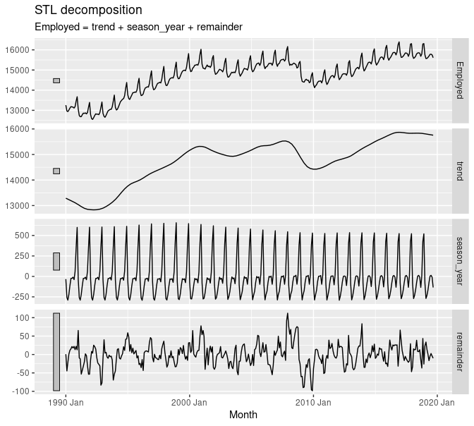

<!--
{target="_blank"}
-->

<style>
h1{font-weight: 400;}
</style>


This website can be found at [bit.ly/EFI_forecasting](https://bit.ly/EFI_forecasting){target="_blank"}.

# Summary

Have students create a time series decomposition plot like [Figure 3.7](https://otexts.com/fpp3/components.html#fig:emplstl){target="_blank"} from Forecasting Principles and Practice 3rd Edition (FPP3) using ecological data and write a medium.com blogpost on analysis.

```{r, echo=FALSE, out.width="100%", fig.align='center'}

```


# The code

Present a time series, such as this time series of US retail employment from FPP3 Chapter 3...

```{r, message=FALSE, warning = FALSE}
library(tidyverse)
library(fpp3)

us_retail_employment <- us_employment %>%
  filter(year(Month) >= 1990, Title == "Retail Trade") %>%
  select(-Series_ID)

autoplot(us_retail_employment, Employed) +
  labs(y = "Persons (thousands)", 
       title = "Total employment in US retail")
```

... and show that you can separate the **signal** from the **noise**:

```{r}
dcmp <- us_retail_employment %>%
  model(stl = STL(Employed))

components(dcmp) %>%
  as_tsibble() %>%
  autoplot(Employed, colour="gray") +
  geom_line(aes(y=trend), colour = "steelblue") +
  labs(
    y = "Persons (thousands)",
    title = "Total employment in US retail"
  )
```

i.e. the blue trend line is the **signal** and the variation of the times series in grey around this blue line is the **noise**. 

Furthermore this noise can be broken down into a portion that is cyclical (here following an annual pattern) and a residual portion. In other words the original time series can be be broken down into three components:

1. Overall trend component (the "signal" in blue from above)
1. Seasonality component
1. Remainder component

```{r}
components(dcmp) %>% 
  autoplot()
```

i.e. the "Employed" time series on top is equal to the sum of the three bottom times series. Note the vertical grey bars on the left-hand side of all four plots are the same absolute height (about 200 persons) and thus can be used to compare the unit scale on all four plots.

Observe that after accounting for the overall trend and seasonality patterns in employments, US retail employment was particularly low in January 2010.


# The blogpost

Then have students write a blogpost on Medium.com. 

```{r, echo=FALSE, out.width="50%", fig.align='center'}
knitr::include_graphics("static/images/medium.png")
```

This will encourage your students to work on their writing as well as their presentation skills. Furthermore it gives an item to add to their portfolios. Some advantages of the Medium.com over other formats (e.g. Google Docs)

1. Formatting tools are just powerful enough to give flexibility in expression, without overwhelming writer.
1. Mechanism for delivering private feedback
1. Part of a much larger blog ecosystem that is recognized


# Examples

1. [So... How Much Glacier Are We Losing?](https://ohandoko.medium.com/so-how-much-glacier-are-we-losing-8d1471252750){target="_blank"} by Olivia Handoko
1. [Forecasting the change of sea ice extent globally](https://pchau-38154.medium.com/forecasting-the-change-of-sea-ice-extent-globally-d0b1f21ce24a){target="_blank"} by Candy Chau
1. [Team Project in Glacier Data Analysis](https://sli58.medium.com/team-project-in-glacier-data-analysis-5aad665ba0b0){target="_blank"} by Serena Li


# Tips

1. Have students build their first time series decomposition plot **as soon as possible**. Hadley Wickham calls this the "race to the first data visualization." The `fpp3` package has a lot of custom functions that allow users to make plots and run basic analyses without being overly familiar with the `tidyverse`
1. I argue that initially it's more important to focus on a minimally viable product: that students get a feel for time series thinking and know how to interpret results. This rather than expecting them to completely understand the mathematics and the code at first; gaps can be filled later on. 
1. Then go through the preceding chapters in FPP3. Skip chapters as needed depending on your students' background.


# Power move

If situation and student interest allows, have them perform their first forecasting using FPP3 Chapter 5! For example, here is a version of [Figure 5.19](https://otexts.com/fpp3/forecasting-decomposition.html#fig:print-media5){target="_blank"} showing three simple forecasting methods:

```{r}
# Fit the models
model_fit <- us_retail_employment %>%
  model(stlf = decomposition_model(
    STL(Employed ~ trend(window = 7), robust = TRUE),
    NAIVE(season_adjust)
  ))

# Generate forecasts for 50 months
employment_fc <- model_fit %>% 
  forecast(h = 50)

# Plot forecasts against actual values
employment_fc %>%
  autoplot(us_retail_employment) +
  labs(
    y = "Persons (thousands)",
    title = "Forecasts for US retail employment"
  ) +
  guides(colour = guide_legend(title = "Forecast"))
```


