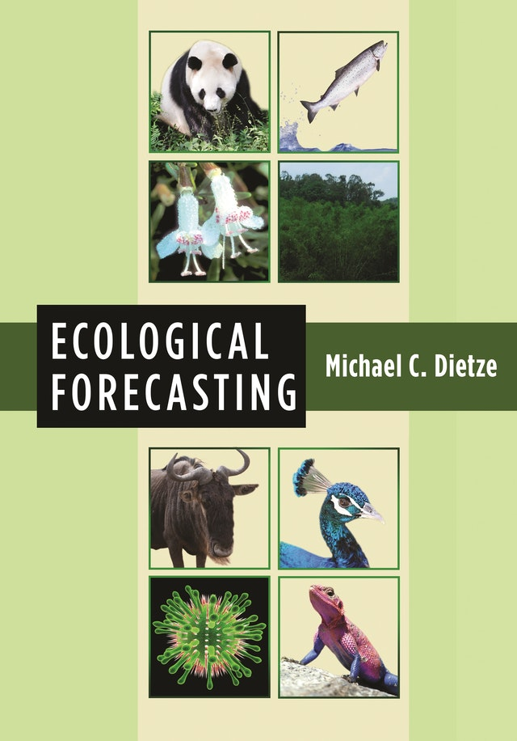

<!--
{target="_blank"}
-->

<style>
h1{font-weight: 400;}
</style>

<!--
From this Google Doc:
https://docs.google.com/document/d/1Ql2phLrzc7fEnBuG9Ii8bIBA6pznXgLvoKpsiFomJHk/edit
-->


## Basic information {#basicinfo}

* **Course title:** SDS 390 Topics in Statistical and Data Sciences - Ecological Forecasting
* **Communication:** All communication will take place via Slack.
    + You must have the [Slack Desktop or Mobile
    App](https://slack.com/downloads/){target="_blank"} installed, since it is
    too easy to miss messages when using the browser version.
    + After you've installed Slack, add the sds-390-2020-09.slack.com workspace.
* **Lectures:** Tue/Thu 9:20am - 10:35am Eastern
* **Pre-requisites:**
    1. SDS 192 Introduction to Data Science
    1. SDS/MTH 291 Multiple Regression
    1. The same pre-reqs as MTH 211 Linear Algebra, which is a required course for the SDS major:
        + MTH 112 Calculus II or 
        + MTH 111 Calculus I and MTH 153 Intro to Discrete Math


## Instructor work-life balance

* I will respond to Slack messages sent during the week within 24h. I will
respond to Slack messages sent during the weekend at my own discretion.
* If possible, please only Slack me with briefer and administrative questions; I
prefer having more substantive conversations over Zoom as it takes me less
energy to understand where you are at.
* I will do my best to return all grading as promptly as possible.


***


# Course Description & Objectives

**Official course description**: Ecologists are asked to respond to
unprecedented environmental challenges. How can they provide the best scientific
information about what will happen in the future? The goal of this seminar is to
bring together the concepts and tools needed to make ecology a more predictive
science. Topics include Bayesian calibration and the complexities of real-world
data; uncertainty quantification, partitioning, propagation, and analysis;
feedback from models to measurements; state-space models and data fusion;
iterative forecasting and the forecast cycle; and decision support. A
semester-long project will center on data from the [Smithsonian Conservation
Biology Institute (SCBI) forestry
reserve](https://forestgeo.si.edu/sites/north-america/smithsonian-conservation-biology-institute){target="_blank"}.

**Course objectives and learning goals**: This semester you will:

1. TBD


***


# Topic Schedule and Readings {#topicschedule}

* **Schedule**: On the [main page](index.html) of this course webpage.
* **Textbook**: Prof. Michael C. Dietze's [Ecological
Forecasting](https://press.princeton.edu/books/hardcover/9780691160573/ecological-forecasting){target="_blank"}.
You can find exercise code for each of the chapters in the [EcoForecast GitHub
Repo](https://github.com/EcoForecast/EF_Activities){target="_blank"}

```{r, echo=FALSE, fig.align='center', out.width="40%"}

```


***  


# Evaluation {#evaluation}

TBD


## Policies

TBD


***


# Academic Integrity


***


# Accommodations {#accommodations}
 
Smith is committed to providing support services and reasonable accommodations
to all students with disabilities. To request an accommodation, please register
with the Disability Services Office at the beginning of the semester. To do so,
call 413.585.2071 to arrange an appointment with Laura Rauscher, Director of
Disability Services.

Once you have received an accommodation letter, please provide your instructor
with a copy.


***


# Code of Conduct {#codeofconduct}

As the instructor and assistants for this course, we are committed to making
participation in this course a harassment-free experience for everyone,
regardless of level of experience, gender, gender identity and expression,
sexual orientation, disability, personal appearance, body size, race, ethnicity,
age, or religion. Examples of unacceptable behavior by participants in this
course include the use of sexual language or imagery, derogatory comments or
personal attacks, deliberate misgendering, trolling, public or private
harassment, insults, or other unprofessional conduct.

As the instructor and assistants we have the right and responsibility to point
out and stop behavior that is not aligned to this Code of Conduct. Participants
who do not follow the Code of Conduct may be reprimanded for such behavior.
Instances of abusive, harassing, or otherwise unacceptable behavior may be
reported by contacting the instructor.

**All students, the instructor, the lab instructor, and all assistants are
expected to adhere to this Code of Conduct in all settings for this course:
lectures, labs, office hours, tutoring hours, and over Slack.**

This Code of Conduct is adapted from the [Contributor
Covenant](http://contributor-covenant.org){target="_blank"}, version 1.0.0,
available [here](http://contributor-covenant.org/version/1/0/0/){target="_blank"}.


